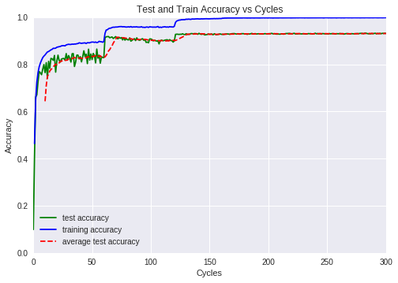
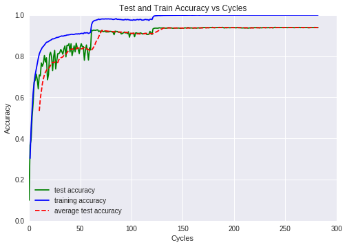
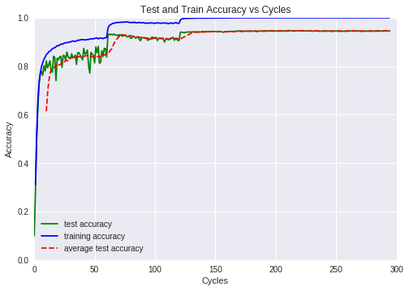

# A (Yet Another) PyTorch (0.4.0) Implementation of Residual Networks

This is a [PyTorch](http://pytorch.org/) implementation of the
Residual Network architecture with basic blocks as described
paper [Deep Residual Learning for Image Recognition](https://arxiv.org/abs/1512.03385)
by Kaiming He, Xiangyu Zhang, Shaoqing Ren and Jian Sun.
This implementation gets a CIFAR10 test accuracy of %92-93 percent
when 18 layers with initial depth of 16 are used (in the paper they also achieve %93 
percent with the same setting). Increasing the width of the depth of the network can
increase the accuracy up to %94-95 percent (see below). Different annealing schemes 
or changing the order of the batchnorm and relu does not  seem to make any significant 
improvements but this requires more testing to make sure. SGD with a decreasing learning 
rate and weight decay=0.0005 seems to perform the best among all optimizers. Applying 
random rotations, flips and crops to the training set at the beginning of each cycle 
to boost the variety in training set seems to improve the accuracy by about %1-2 percent. 
ZCA data whitening and layer-wise properties  (setting the weight decays for bias layers to 0) 
are also implemented.ZCA data whitening does not seem to improve the results more than
normalization of standard deviation.

# Architectural details

The network contains an initial convolution + 3 stages of residual blocks. 
The number of residual blocks inside each stage as well as the initial width 
of the first block can be given as inputs to the network constructer. The width 
then increases as 3 -> width -> 2* width -> 4* width -> 8* width. Convolution 
shortcut connections as well as usual addition are used as the "identity" mappings. 

# Implementation details

The code has been implemented for pytorch 0.4. 

# CIFAR-10 Results for various settings 

### Implementation of ResNet18 with step-wise learning rate

Best test accuracy: 0.93210, training accuracy: 0.99820 (cost:0.01380)

| Class  | Score                                       |
|--------|---------------------------------------------|
| plane  | Precision:0.93, Recall: 0.93, F1 norm: 0.93 | 
| car    | Precision:0.96, Recall: 0.96, F1 norm: 0.96 | 
| bird   | Precision:0.92, Recall: 0.90, F1 norm: 0.91 | 
| cat    | Precision:0.86, Recall: 0.87, F1 norm: 0.87 | 
| deer   | Precision:0.92, Recall: 0.95, F1 norm: 0.94 | 
| dog    | Precision:0.90, Recall: 0.89, F1 norm: 0.90 | 
| frog   | Precision:0.96, Recall: 0.95, F1 norm: 0.96 | 
| horse  | Precision:0.96, Recall: 0.95, F1 norm: 0.95 | 
| ship   | Precision:0.95, Recall: 0.95, F1 norm: 0.95 | 
| truck  | Precision:0.94, Recall: 0.95, F1 norm: 0.95 | 

| class  | plane  | car    | bird   | cat    | deer   | dog    | frog   | horse  | ship   | truck  |
|--------|--------|--------|--------|--------|--------|--------|--------|--------|--------|--------|
| plane  | 0.93200| 0.00800| 0.01600| 0.00700| 0.00300| 0.00100| 0.00300| 0.00200| 0.02000| 0.00800|
| car    | 0.00400| 0.96400| 0.00000| 0.00000| 0.00000| 0.00000| 0.00100| 0.00100| 0.00600| 0.02400|
| bird   | 0.01800| 0.00000| 0.90300| 0.02200| 0.01900| 0.00900| 0.01500| 0.00800| 0.00400| 0.00200|
| cat    | 0.00600| 0.00200| 0.01400| 0.86900| 0.01700| 0.05900| 0.01400| 0.00700| 0.00600| 0.00600|
| deer   | 0.00300| 0.00000| 0.01000| 0.01500| 0.94700| 0.01000| 0.00300| 0.01000| 0.00000| 0.00200|
| dog    | 0.00400| 0.00100| 0.01100| 0.06200| 0.01900| 0.89200| 0.00100| 0.00800| 0.00000| 0.00200|
| frog   | 0.00500| 0.00100| 0.01200| 0.01400| 0.00800| 0.00300| 0.95100| 0.00200| 0.00200| 0.00200|
| horse  | 0.00400| 0.00000| 0.00600| 0.01200| 0.01100| 0.01300| 0.00000| 0.94800| 0.00200| 0.00400|
| ship   | 0.02200| 0.00400| 0.00600| 0.00300| 0.00000| 0.00200| 0.00100| 0.00100| 0.95500| 0.00600|
| truck  | 0.00700| 0.02800| 0.00100| 0.00200| 0.00000| 0.00000| 0.00000| 0.00000| 0.01200| 0.95000|

### Implementation of ResNet18 with initial width 32

Best test accuracy: 0.94030, training accuracy: 0.99970 (cost:0.00475)

Cycle:  280
Training time for cycle 279 is 127.36  Cost calculation time is 12.73

| Class  | Score                                       |
|--------|---------------------------------------------|
| plane  | Precision:0.94, Recall: 0.94, F1 norm: 0.94 | 
| car    | Precision:0.96, Recall: 0.97, F1 norm: 0.97 | 
| bird   | Precision:0.92, Recall: 0.91, F1 norm: 0.92 | 
| cat    | Precision:0.87, Recall: 0.87, F1 norm: 0.87 | 
| deer   | Precision:0.94, Recall: 0.95, F1 norm: 0.94 | 
| dog    | Precision:0.90, Recall: 0.90, F1 norm: 0.90 | 
| frog   | Precision:0.96, Recall: 0.96, F1 norm: 0.96 | 
| horse  | Precision:0.97, Recall: 0.96, F1 norm: 0.96 | 
| ship   | Precision:0.96, Recall: 0.96, F1 norm: 0.96 | 
| truck  | Precision:0.96, Recall: 0.96, F1 norm: 0.96 | 

| class  | plane  | car    | bird   | cat    | deer   | dog    | frog   | horse  | ship   | truck  |
|--------|--------|--------|--------|--------|--------|--------|--------|--------|--------|--------|
| plane  | 0.94100| 0.00600| 0.01100| 0.01100| 0.00200| 0.00000| 0.00400| 0.00400| 0.01400| 0.00700|
| car    | 0.00300| 0.97200| 0.00100| 0.00000| 0.00000| 0.00000| 0.00000| 0.00100| 0.00200| 0.02100|
| bird   | 0.01500| 0.00000| 0.91000| 0.02300| 0.01900| 0.00900| 0.01700| 0.00400| 0.00200| 0.00100|
| cat    | 0.00300| 0.00400| 0.01600| 0.87200| 0.01500| 0.06700| 0.01000| 0.00400| 0.00400| 0.00500|
| deer   | 0.00300| 0.00100| 0.01000| 0.01200| 0.95200| 0.00700| 0.00700| 0.00800| 0.00000| 0.00000|
| dog    | 0.00200| 0.00000| 0.01700| 0.05200| 0.01800| 0.90100| 0.00200| 0.00700| 0.00000| 0.00100|
| frog   | 0.00300| 0.00000| 0.01100| 0.01500| 0.00300| 0.00400| 0.96100| 0.00200| 0.00000| 0.00100|
| horse  | 0.00700| 0.00000| 0.00400| 0.00800| 0.00600| 0.01300| 0.00200| 0.95700| 0.00200| 0.00100|
| ship   | 0.01800| 0.00600| 0.00300| 0.00200| 0.00000| 0.00100| 0.00200| 0.00100| 0.96100| 0.00600|
| truck  | 0.00500| 0.02100| 0.00100| 0.00200| 0.00000| 0.00000| 0.00000| 0.00000| 0.01100| 0.96000|

### Implementation of ResNet with lengtf of 32 layers

Best test accuracy: 0.94730, training accuracy: 0.99952 (cost:0.00385)

| Class  | Score                                       |
|--------|---------------------------------------------|
| plane  | Precision:0.97, Recall: 0.94, F1 norm: 0.96 | 
| car    | Precision:0.97, Recall: 0.97, F1 norm: 0.97 | 
| bird   | Precision:0.93, Recall: 0.93, F1 norm: 0.93 | 
| cat    | Precision:0.89, Recall: 0.88, F1 norm: 0.89 | 
| deer   | Precision:0.94, Recall: 0.95, F1 norm: 0.95 | 
| dog    | Precision:0.90, Recall: 0.92, F1 norm: 0.91 | 
| frog   | Precision:0.97, Recall: 0.97, F1 norm: 0.97 | 
| horse  | Precision:0.96, Recall: 0.96, F1 norm: 0.96 | 
| ship   | Precision:0.96, Recall: 0.97, F1 norm: 0.96 | 
| truck  | Precision:0.96, Recall: 0.96, F1 norm: 0.96 | 

| class  | plane  | car    | bird   | cat    | deer   | dog    | frog   | horse  | ship   | truck  |
|--------|--------|--------|--------|--------|--------|--------|--------|--------|--------|--------|
| plane  | 0.94300| 0.00200| 0.01400| 0.00700| 0.00600| 0.00100| 0.00000| 0.00200| 0.01600| 0.00900|
| car    | 0.00200| 0.97500| 0.00100| 0.00000| 0.00000| 0.00000| 0.00000| 0.00000| 0.00300| 0.01900|
| bird   | 0.00600| 0.00000| 0.93100| 0.01800| 0.01100| 0.01000| 0.01200| 0.00900| 0.00300| 0.00000|
| cat    | 0.00300| 0.00000| 0.01800| 0.88200| 0.01600| 0.06000| 0.01000| 0.00500| 0.00400| 0.00200|
| deer   | 0.00000| 0.00000| 0.01000| 0.01100| 0.95200| 0.01000| 0.00500| 0.01000| 0.00100| 0.00100|
| dog    | 0.00000| 0.00100| 0.01000| 0.04700| 0.01400| 0.91500| 0.00400| 0.00800| 0.00000| 0.00100|
| frog   | 0.00200| 0.00100| 0.01100| 0.00900| 0.00200| 0.00700| 0.96700| 0.00000| 0.00000| 0.00100|
| horse  | 0.00200| 0.00000| 0.00400| 0.00800| 0.01200| 0.01400| 0.00000| 0.95800| 0.00100| 0.00100|
| ship   | 0.01300| 0.00300| 0.00300| 0.00400| 0.00100| 0.00000| 0.00000| 0.00100| 0.96700| 0.00800|
| truck  | 0.00300| 0.02200| 0.00100| 0.00300| 0.00000| 0.00000| 0.00000| 0.00000| 0.01000| 0.96100|

### Discussion
Note that a high precision, low recall for an object X means that the network is very cautious 
about this object. So for many objects which are X, the network might say "this is not X", but if it says
"it is X" then it is very likely to be correct. So its true guesses are very precise but can not 
recall many X's.

A high recall but low precision for an object X means that the network is very good at finding all the objects
which are X but it overshoots. So it identifies most of all the objects X as X but it also identifies many other
which are not X as X as well. So it is not very precise but recalls all the X.

In this case we see that cats and dogs have both lower recall and precision compared to others.
This likely means that the program confuses cats and dogs with each other. The confusion matrix for the first case confirms this
a cat is most likely to be confused with a dog (5 times more compared to other objects) followed by deers and birds and the same is true for the dog as well.

# Requirements

Pytorch 0.3 and internet connection to download the datasets.

# Author
Sina Tureli
Yet Another Implementation of Residual Networks

# Licensing

This repository is
[Apache-licensed](https://github.com/bamos/densenet.pytorch/blob/master/LICENSE).
